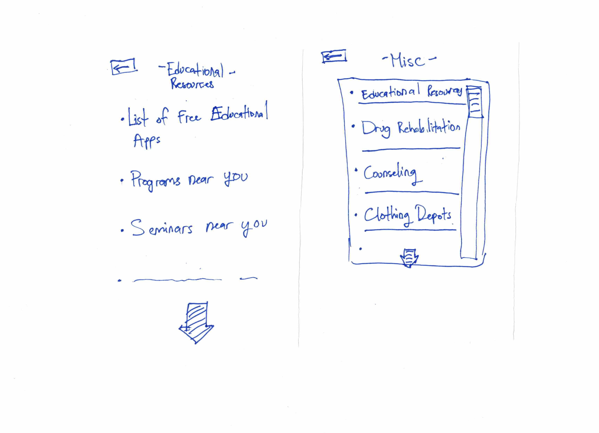

# The Destroyers

## Egbert Doan, Jonathan Kiger, Alvin Pascua, Marc Raphael

# Proposal
Our app's target user population are homeless people in San Diego (city). None of our team members are part of this population because we all have reliable and continuous housing. Our choice of homeless people as the user population fits the project theme not only because none of our team members are part of this population, but also because are lives are all significantly different from those of homeless people, so it will take a concerted effort to understand and design for their needs in depth. We chose to limit our population to San Diego because then we would be able to consider the specific problems that homeless San Diegans face and could address them with specific San Diego resources/solutions.

A possible API that we might use is the Google Maps API in order to help navigate homeless people to different locations that are preferably walking distance from useful resources. We could also potentially use the Google Places API to get up-to-date information about the different homeless shelters, food banks, healthcare centers, and general resources. 

## Storyboard 1

## Storyboard 2

## Prototype 1

## Prototype 2
