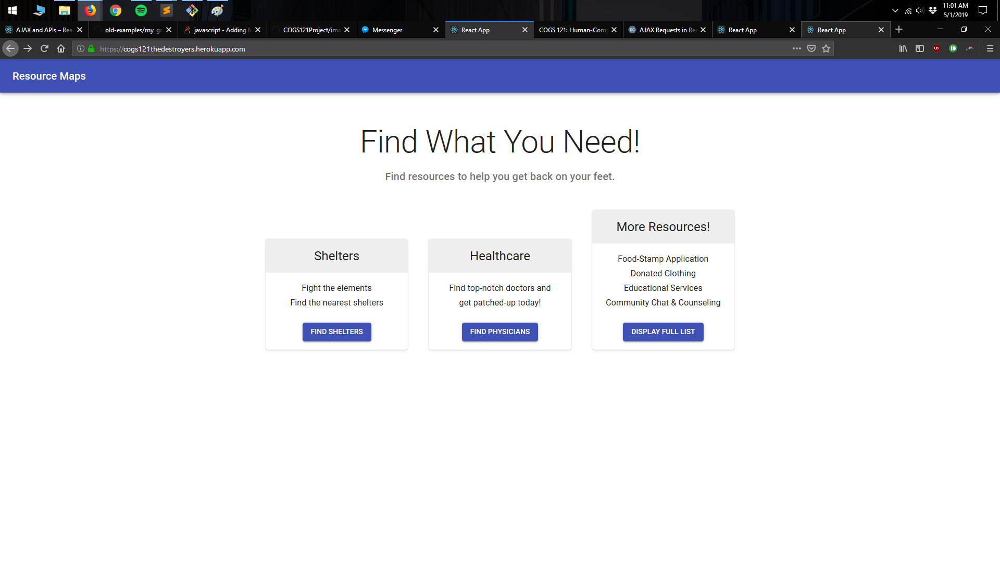
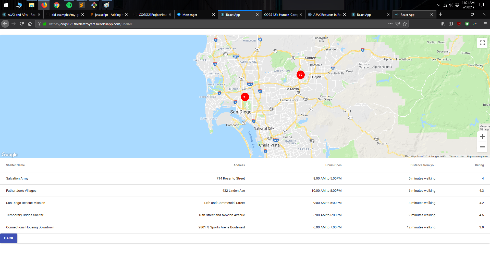

# Milestone 2

### How our idea is similar to or differs from what we proposed in Milestone 1. 
Our idea is similar to what we proposed in Milestone 1 because our user population are still homeless people in San Diego, and we still have the goal of building a web application which gives them access to necessary resources such as healthcare, food, and shelter. We also still plan to use Google Maps API to display resources that are nearest to the user, and to be able to allow for quick navigation to each resource. We thought that designing this user interface to be intuitive and working with Google Maps API would be an interesting and complex problem to solve and had gotten positive feedback from the TA on the idea, so we decided to continue with it.  

### Screenshots of all our UI skeleton webpages.

## Home 1

## Second Screen

### How our screenshots are similar to or differ from our paper prototypes in Milestone 1.
Our screenshots are similar to the second paper prototype we created in that the home page allows the user to browse through healthcare, food banks, and shelter. However, we also added a section underneath these buttons which allows the user to quickly view the resources that are nearest to them, which was inspired by the same feature on the first prototype. We did this because we thought that the ability to quickly browse the nearest resources on the landing page would be useful for a homeless person who really wanted to find a food bank or healthcare center quickly. So, to summarize, while the majority of the skeleton was inspired by the second paper prototype, we also integrated a feature of the first prototype that we thought improved the user experience. 

