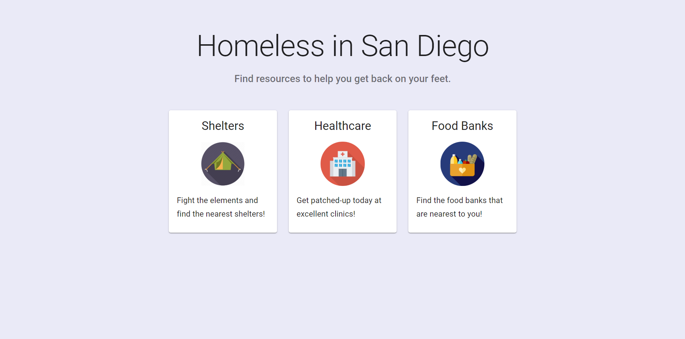
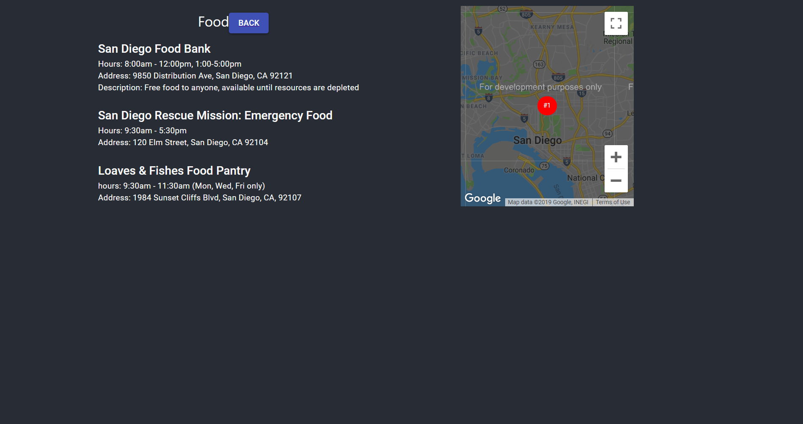
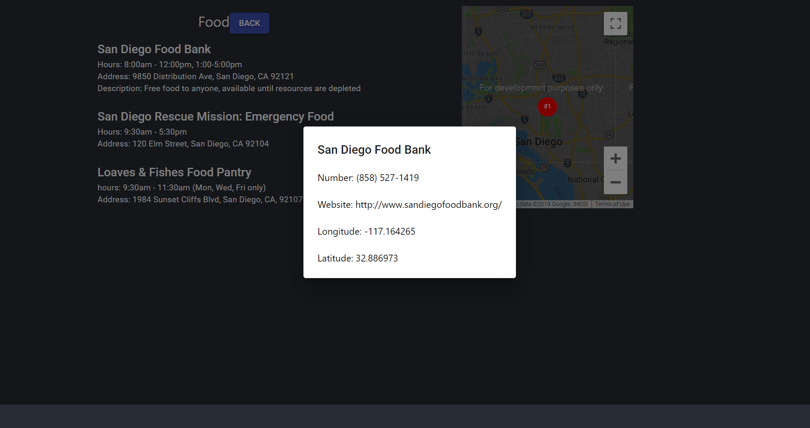
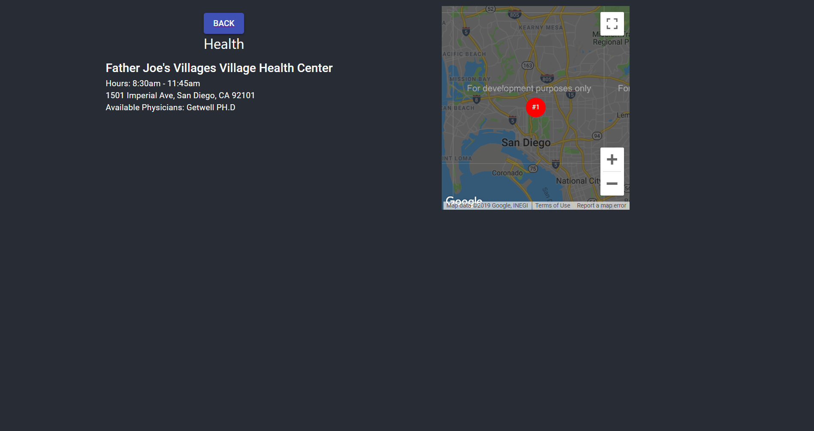
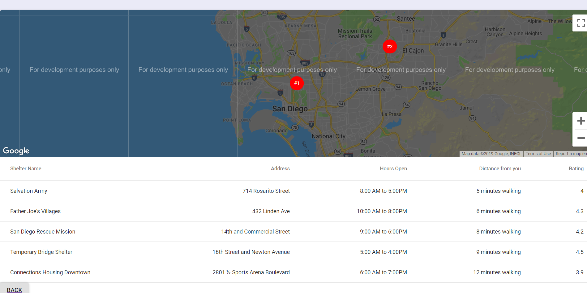

# Milestone3

## Screenshots of latest UI skeleton webpages

### Home Screen

### Food Screen

### Food Ajax Call 

### Healthcare

### Shelter

## How our screenshots have been improved upon the versions shows in milestone2
Our UI skeleton screenshots have improved in a noticeable way because we overhauled the UI of the home page. We changed the buttons into full cards that the user can click on to get to the different resources. We included icons which represented each resource in a visual way. We changed the descriptions to shorten them and make them more engaging. We also changed the background color to add character to the user interface. We also created an alert for when we make an Ajax call to Google Places API on the food page that displays the phone number, website, and latitude and longitude. Finally, we also added to the Healthcare page so that it is similar to the Food Banks page instead of being empty. Moreover, all of our resource pages have actual, real resources listed on them now. 

