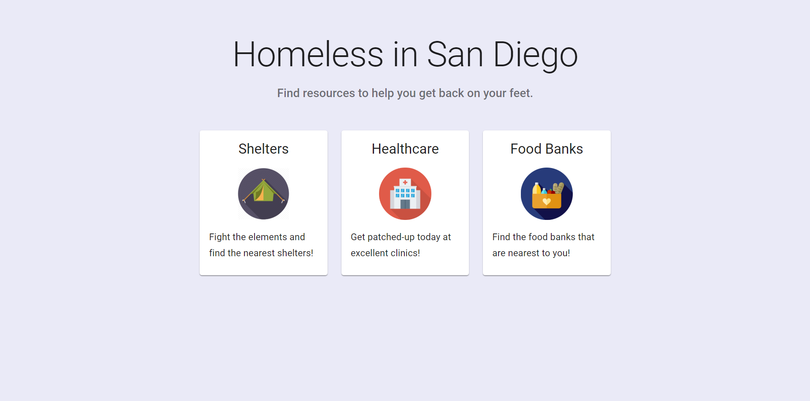
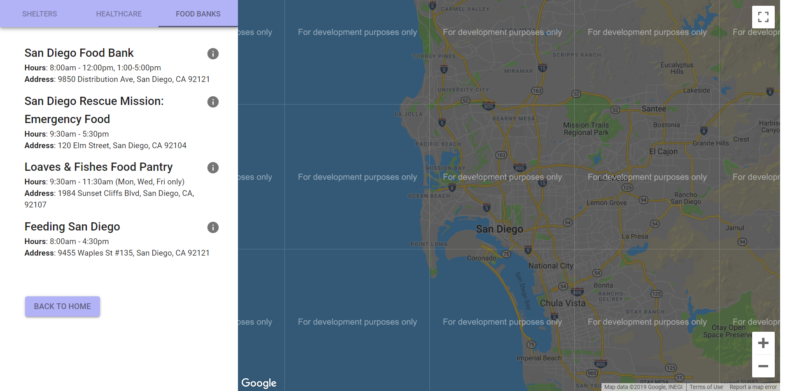
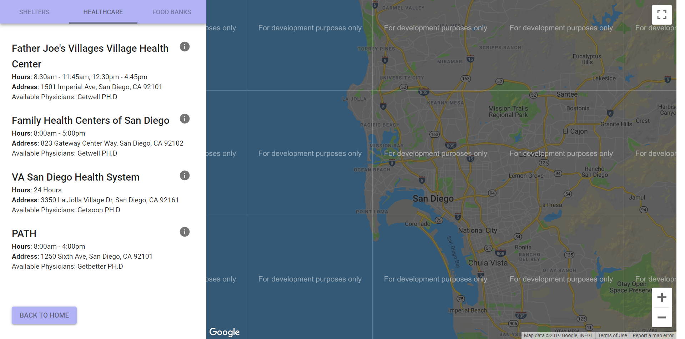
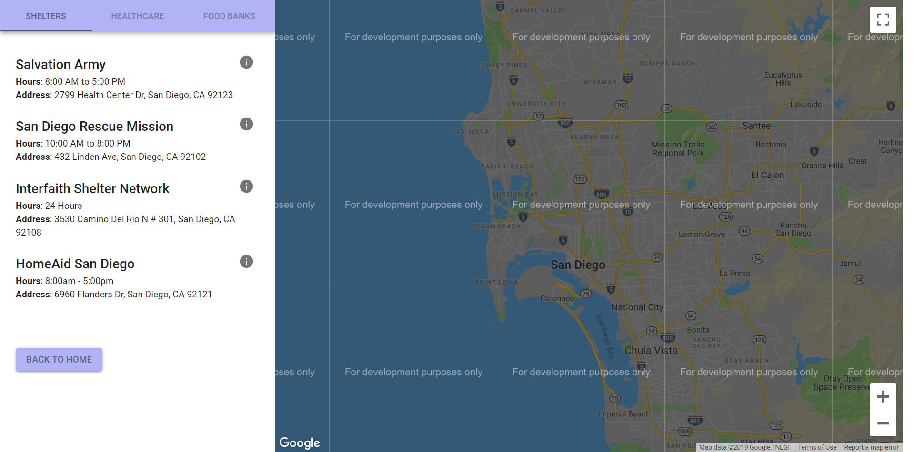
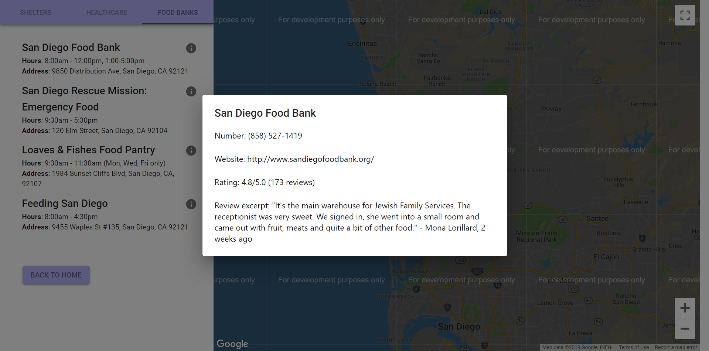

# Milestone 5

## How a user can use our app to achieve their goals

## UI Screenshots

### Home Screen

### Food Banks

### Healthcare

### Shelter

## How our UI has improved

Our user interface has improved in several ways. Firstly, the colors on the resources pages have been completely changed to match the color scheme of the home page. Second, the typography among each different resource (food banks, shelters, and healthcare) was changed to make it consistent across resources. Also, we increased the font weight on subtitles such as hours and address to differentiate them visually from the content. Also, we changed the UI's implementation and the size of each component so that it works on nearly every display size. Previously, the info icon buttons would collapse into the list item but these bugs were fixed. Also, the size of the Google Maps component now changes as the browser size changes so it never becomes too large. Finally, the marker for the Google Maps was changed from a circle to a more traditional pointer. 

## Data Display Screenshot

## How we implemented our data display

We implemented our data display by using Google Places API and Google Maps API to display the resource's details, including phone number, website, rating, number of ratings, and reviews, as well as the resource's geographical position in a map, respectively. We made a Google Places call for each resource, the code of which can be found in src/pages/Food.js, which returned a long json object. We filtered through this json object and selected the most pertinent information, which includes the phone number, website, rating, number of ratings, and sample reviews. We then formatted this information into a dialog with subtitles for each information and displayed it. We used the latitude and longitude from the Google Places API call to display the geographical location of the resource in a map. 

## Ambitious Data Display Ideas

More ambitious data display ideas that we have is being able to display the resources in order of those that are closest to you, and being able to display the walking distance to each resource. Also, being able to display some of the information from the Google Places API call, such as rating and distance, hovering above the marker on Google Maps would be a more intuitive interface and would be a more ambitious project. 

